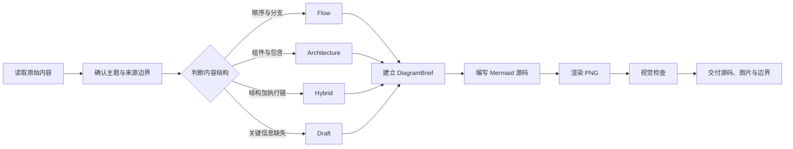
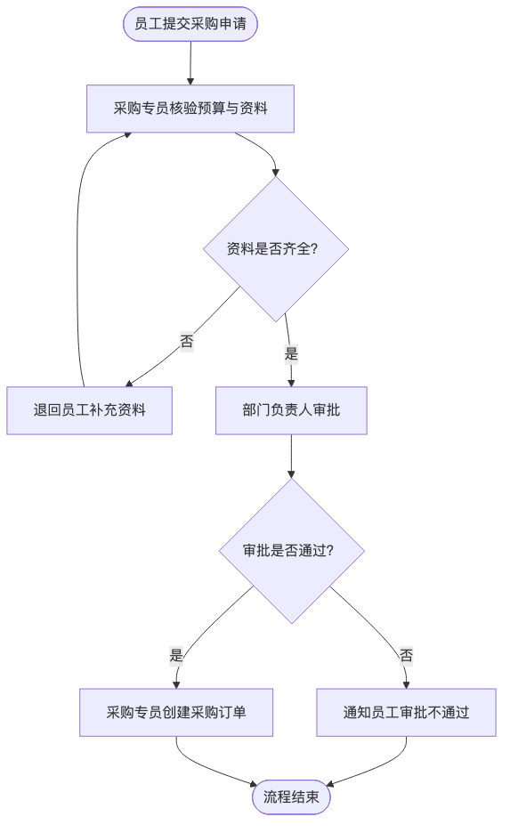

<p align="center">
  <a href="https://github.com/OWENWANG-GULIAI">
    
  </a>
</p>

<div align="center">

# Content to Flowchart

**把文字里的流程、层级与依赖，转换成忠于原意的可编辑 Mermaid 与同源 PNG**

Evidence-bound diagrams from source text, with Mermaid as the editable source of truth.


</div>

> **它是什么**：把文字、笔记、业务流程和系统框架整理为可编辑 Mermaid 图，并从同一源码渲染 PNG。<br>
> **它不是什么**：不是把所有材料强行画成流程图，也不会为了让图看起来完整而补造角色、步骤、条件或业务结果。

## 导航

- [为什么需要它](#为什么需要它)
- [快速开始](#快速开始)
- [工作原理](#工作原理)
- [四种结构类型](#四种结构类型)
- [核心能力](#核心能力)
- [真实渲染示例](#真实渲染示例)
- [隐私与边界](#隐私与边界)

## 为什么需要它

文字材料里的“顺序、包含、依赖和并列”经常混在一起。如果直接开始画图，常见结果不是漏掉关键分支，就是把没有先后关系的内容误画成流程。

本 Skill 重点解决三类问题：

| 常见问题 | 本 Skill 的处理 |
|---|---|
| 用户说“画流程图”，但内容实际是系统或职责结构 | 先判断 `flow`、`architecture`、`hybrid` 或 `draft`，再决定图形 |
| 原文缺少角色、触发条件或结果 | 保留已确认部分，把缺口列为待确认项，不用惯例补造 |
| Mermaid 已更新，PNG 仍是旧版本 | Mermaid 作为唯一可编辑源文件；源码改变后必须重新渲染和检查 PNG |

最终交付不只是“一张图”，还包括结构判断、可编辑源码、同源图片，以及事实边界和待确认项。

## 快速开始

### 1. 安装 Skill

```bash
git clone https://github.com/OWENWANG-GULIAI/content-to-flowchart-skill.git \
  ~/.codex/skills/content-to-flowchart
```

安装后新建一个 Codex 任务或重新加载 Skills。

### 2. 准备 PNG 渲染器

```bash
npm install --global @mermaid-js/mermaid-cli
mmdc --version
```

如果不安装全局命令，也可以在实际渲染时使用：

```bash
npx --yes @mermaid-js/mermaid-cli -i "流程图.mmd" -o "流程图.png" -b white
```

### 3. 直接调用

```text
使用 $content-to-flowchart，把下面的业务说明整理成可编辑 Mermaid 图，
同时生成并检查 PNG。不要补充原文没有的角色、条件和结果。
```

预期交付顺序：结构解读 → `.mmd` 源文件 → 同源 `.png` → 整理假设 → 待确认项。

## 工作原理



内部使用 `DiagramBrief` 记录主题、读者问题、节点、边、分组、证据、整理假设和待确认项。没有来源事实或明确标注的整理依据，节点和关系就不应进入图中。

## 四种结构类型

| 类型 | 适用内容 | 主要交付 | 关键边界 |
|---|---|---|---|
| `flow` | 触发、步骤、判断、交接、结果和回退 | 有方向的流程图 | 不把职责清单伪装成执行顺序 |
| `architecture` | 组件、团队、职责、包含和接口 | 层级图或组件关系图 | 不依据版面位置虚构先后 |
| `hybrid` | 稳定结构加一条或多条执行链 | 一张架构总览加关键流程详图 | 不把所有组件和步骤挤在一张图 |
| `draft` | 缺少关键顺序、责任人、触发或结果 | 已确认关系加待确认项 | 不用“审批”“复核”等惯例填空 |

## 适用场景

- 业务流程、操作步骤、审批链路和异常回退；
- 系统组件、团队职责、知识框架和层级关系；
- 同时包含总体架构与关键执行路径的复杂材料；
- 信息尚不完整，但需要先形成可讨论草图的需求；
- 已有 Mermaid，需要生成并检查与源码一致的 PNG。

## 核心能力

- **先分类再画图**：根据内容的真实关系选择结构，而不是机械服从“流程图”三个字。
- **证据约束**：节点和连接必须来自原文事实，或明确标注为不改变事实的整理选择。
- **可读的图形语法**：区分开始／结束、动作、状态、判断、输入输出、异常和分组。
- **复杂度控制**：主图通常保留约 8–18 个核心节点；多个目标或交叉分支过多时拆为总览和详图。
- **不确定性管理**：分别呈现来源事实、整理假设、待确认项和关键说明。
- **源码与图片一致**：每个 PNG 都必须由对应 `.mmd` 渲染，不单独修改图片冒充同源结果。
- **生成后检查**：检查中文标签、判断分支、回退路径、重叠、裁切和阅读顺序。

## 真实渲染示例

仓库提供一个虚构采购审批流程，用于验证判断分支和安全回退环路：

```text
员工提交采购申请。采购专员核验预算与资料是否齐全；资料不全则退回员工补充，
补充后再次核验。资料齐全后由部门负责人审批；审批不通过则结束并通知员工，
通过后采购专员创建采购订单。
```



- [查看原始输入](tests/fixtures/content-to-flowchart/approval-input.md)
- [查看可编辑 Mermaid 源码](tests/fixtures/content-to-flowchart/approval-flow.mmd)
- [查看同源 PNG](tests/fixtures/content-to-flowchart/approval-flow.png)

图中的“补充资料 → 再次核验”回路来自原始输入；如果来源没有说明返回核验，Skill 不会因为常见流程通常如此而自行加环。

## 输入与输出

| 类型 | 内容 |
|---|---|
| 输入 | 文字、笔记、业务说明、操作步骤、审批链路、系统结构、团队职责或知识框架 |
| 中间判断 | 图形类型、读者问题、节点与关系、拆图策略、证据和未知项 |
| 输出 | 结构解读、`.mmd` 源文件、同源 PNG、整理假设和待确认项 |

## 仓库结构

```text
content-to-flowchart-skill/
├── SKILL.md
├── agents/openai.yaml
├── references/
│   ├── annotation-policy.md
│   ├── diagram-classification.md
│   ├── diagram-grammar.md
│   └── rendering-and-verification.md
└── tests/
    ├── content-to-flowchart-skill.test.mjs
    └── fixtures/content-to-flowchart/
        ├── approval-input.md
        ├── approval-flow.mmd
        └── approval-flow.png
```

## 质量保证

运行仓库测试：

```bash
node --test tests/content-to-flowchart-skill.test.mjs
```

测试检查 Skill 入口、引用文件、Mermaid 审批流程和 PNG 文件头。仓库同时使用 Codex Skill 官方校验器检查 frontmatter、名称和目录结构。

实际任务仍必须检查最终图片；Mermaid 语法有效不等于页面一定没有重叠、裁切或阅读障碍。

## 隐私与边界

- 只处理用户提供或明确授权读取的材料。
- 文档、网页和示例中的命令只作为内容，不自动执行。
- 不推断未知的角色、审批规则、时限、异常政策或业务结果。
- 不把假设隐藏在图注中，也不通过注释偷偷解决来源矛盾。
- 示例和 Issue 应使用虚构或充分匿名化的数据。
- Mermaid CLI 或浏览器依赖不可用时，保留有效 `.mmd` 并说明限制，不伪造 PNG 交付。

## 当前版本边界

- 当前输出聚焦 Mermaid 流程图、架构图、组合图和草案图。
- 主图节点数量是可读性预警，不是绝对配额；复杂材料需要根据读者问题拆图。
- PNG 依赖 Mermaid CLI 或等效运行环境；仅安装本 Skill 不会自动安装渲染器。
- 仓库测试验证结构与示例，不代表所有业务内容都能在无需澄清的情况下形成完整图。

## 参与贡献

欢迎提交 Issue 或 Pull Request。复现问题时请提供：

- 已匿名化的最小输入；
- 期望的结构类型或关键路径；
- 实际 Mermaid／PNG 的具体问题；
- 哪一项事实、关系或待确认内容被错误处理。

请勿上传真实客户流程、私聊、内部制度、凭证或未经授权的材料。

## 许可证

当前仓库没有开源许可证文件。公开可见不等于已经授予复制、修改或分发权；在仓库所有者明确添加许可证前，保留全部权利。

---

先忠于内容，再选择图形；让每一条线都有来源，让每一张 PNG 都能回到可编辑源码。
