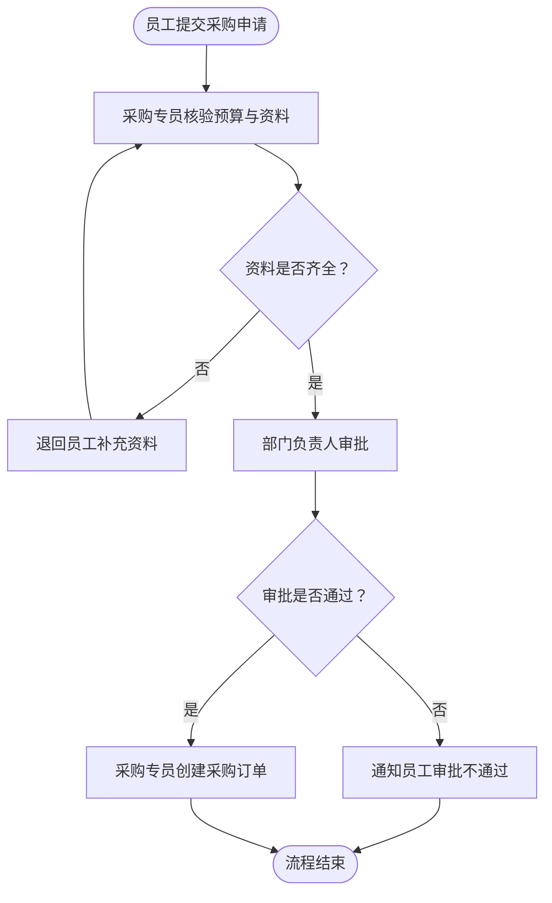

# Diagram grammar

## Working brief

Before authoring Mermaid, keep this compact working model:

```text
DiagramBrief
├── topic and source boundary
├── type: flow | architecture | hybrid | draft
├── goal and reader question
├── actors_and_systems[]
├── nodes[]: id, label, kind, owner, evidence
├── edges[]: from, to, relation, label, evidence
├── groups[]
├── assumptions[]
└── open_questions[]
```

`evidence` means a source sentence or clearly labelled organizing inference. A node or edge without either does not enter the diagram.

## What belongs in a graph

Keep starts, ends, meaningful actions, durable states, decisions, handoffs, dependencies, exception paths, retry loops, and outputs. Exclude rhetorical background, examples, duplicated explanation, long policy language, and details that do not alter a route. Put excluded context in the structure reading or notes.

Use short labels, normally “动词 + 对象”: `核验申请资料`, `补充预算证明`, `创建采购订单`. Do not combine several independently owned actions in one node. A decision must be a question with every consequential outgoing edge labelled.

## Mermaid conventions

| Meaning | Preferred Mermaid form | Rule |
|---|---|---|
| Start/end | `([开始])` | State the boundary or outcome |
| Action/state | `[核验资料]` | One action or state per node |
| Decision | `{资料是否齐全？}` | Label every outcome edge |
| Input/output | `[/采购申请/]` | Use only for material inputs/outputs |
| Group | `subgraph 阶段名` | Group by one useful dimension |
| Exception | `[通知并升级]` with exception style | Keep it beside the main path |

Use `flowchart TD` by default. Use `flowchart LR` only for a short, linear chain. Keep the main route visually continuous; place retry and exception edges off to the side. A `subgraph` may represent phases, roles, departments, or systems, but choose the one grouping dimension that makes ownership easiest to understand.

Use a small semantic palette. Styling reinforces shape and labels; it cannot be the only carrier of meaning.

```mermaid
classDef action fill:#EAF2FF,stroke:#3B82F6,color:#111827;
classDef decision fill:#FFF7E6,stroke:#D97706,color:#111827;
classDef exception fill:#FEECEC,stroke:#DC2626,color:#111827;
```

## Complete flow example



The loop exists because the source explicitly says supplementation returns to verification. Do not add a loop merely because an ordinary process might have one.
