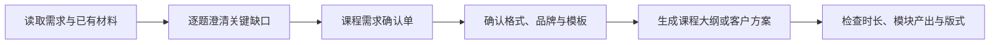

<div align="center">

<p></p>

# 企业内训大纲设计器

**把模糊的企业培训需求，转成经确认、可交付的课程大纲或客户方案。**


</div>

> **定位**：面向企业内训咨询的 Codex Skill，通过逐题访谈、需求确认和交付检查，生成客户可用的课程大纲与方案。
>
> **不做什么**：不把未确认的推测写成客户事实；关键需求缺失时不直接生成正式大纲；未确认交付形式时不额外创建 Word 或 HTML 文件。

## 导航

- [为什么需要它](#为什么需要它)
- [快速开始](#快速开始)
- [使用方法](#使用方法)
- [工作原理](#工作原理)
- [核心能力](#核心能力)
- [输入与输出](#输入与输出)
- [隐私与安全](#隐私与安全)

## 为什么需要它

客户常以一句“给销售团队做一场 AI 培训”开启沟通，但课程能否落地，取决于学员画像、真实业务问题、培训后的工作成果、时长与实施条件。直接套用通用课程大纲，容易把设计猜测误写为客户需求。

本 Skill 把内训咨询中的关键门槛前置：先从已有材料提取事实，再逐题补足影响设计的信息；需求确认后才生成内容，并在交付前核对时长、模块产出、模板和品牌资产。它适合培训顾问、企业学习发展团队、业务负责人及企业讲师使用。

## 快速开始

### 1. 安装到 Codex Skills 目录

**macOS / Linux**

```bash
git clone https://github.com/OWENWANG-GULIAI/enterprise-training-outline-designer.git \
  "${CODEX_HOME:-$HOME/.codex}/skills/enterprise-training-outline-designer"
```

**Windows PowerShell**

```powershell
$skillRoot = if ($env:CODEX_HOME) { Join-Path $env:CODEX_HOME "skills" } else { Join-Path $HOME ".codex\skills" }
git clone https://github.com/OWENWANG-GULIAI/enterprise-training-outline-designer.git (Join-Path $skillRoot "enterprise-training-outline-designer")
```

安装后，在新的 Codex 对话或下一轮请求中通过 `$enterprise-training-outline-designer` 调用。

### 2. 发起需求访谈

```text
Use $enterprise-training-outline-designer to help me design a four-hour AI training course for frontline sales managers. Start by interviewing me one question at a time, then create a Markdown client proposal after I confirm the brief.
```

预期输出：先得到一次一题的需求访谈和《课程需求确认单》；在确认后得到所选格式的课程大纲或客户方案。

## 使用方法

可以直接提供一句需求，也可以附上客户聊天记录、会议纪要、旧课件、制度、模板或脱敏案例。Skill 会提取已经明确的信息，并只追问当前最影响课程设计的一项缺口。

如果需求已完整，明确说明希望的交付形式：聊天版、Markdown、Word 或 HTML。对于 Word 和 HTML，可继续提供企业名称、Logo、品牌色和既有模板；用户资产优先于默认模板。

## 工作原理



1. **需求发现**：只根据客户明确表述记录事实，并优先追问培训后的目标成果、学员、业务问题和时长。
2. **需求确认**：将客户事实、设计理解、拟达成成果与待确认事项分开展示，等待“补充”“修改”或“直接开始生成”。
3. **交付确认**：逐项确认输出形式、品牌化需求与现成模板。
4. **生成与检查**：按确认后的范围输出，并核对所有模块是否有明确产出、时间是否加总正确，以及模板与资产使用是否符合要求。

## 核心能力

- 一次只问一个最影响课程设计的问题；
- 从培训后的可观察工作成果倒推课程模块、练习和模块产出；
- 将客户事实、设计判断与未确认信息清晰分开；
- 支持聊天版、Markdown、Word 与响应式 HTML 方案；
- 对 Word/HTML 的模板、品牌资产、时长和可读性执行交付检查。

## 适用场景

- 将零散的客户沟通整理为可确认的企业培训 Brief；
- 为 AI、管理或业务技能主题设计企业内训大纲；
- 输出可协作的 Markdown 方案、正式 Word 咨询方案或网页化 HTML 方案；
- 在客户既有品牌规范和模板中完成方案交付。

## 示例

> 本例为虚构场景，不包含真实个人、客户或私聊信息。

```text
客户希望给 40 位区域销售经理安排一天的 AI 赋能培训。
学员会使用基础办公工具，但不知道如何把 AI 用于客户拜访准备、复盘和团队管理。
请先梳理需求，一次只问我一个问题。
```

Skill 会先追问培训结束后学员需要实际完成的工作成果；在核心信息完整后输出需求确认单，而不是直接假设课程结构。

## 输入与输出

| 类型 | 内容 |
|---|---|
| 输入 | 培训需求、聊天记录、会议纪要、Brief、旧课件、制度、脱敏案例、现成 Word/HTML 模板与品牌资产 |
| 中间结果 | 结构化 Training Brief、逐题访谈、课程需求确认单、交付选择确认 |
| 输出 | 聊天版客户方案、Markdown 文案、Word 咨询方案或响应式 HTML 方案页 |

## 仓库结构

- [`SKILL.md`](SKILL.md)：核心工作流、状态门禁与生成规则。
- [`agents/openai.yaml`](agents/openai.yaml)：Codex 界面名称与默认调用提示。
- [`references/`](references/)：Brief 字段、访谈规则、交付路由和课程设计参考。
- [`assets/`](assets/)：默认 Word/HTML 方案模板与 GULIAI 品牌 Logo。
- [`scripts/`](scripts/)：下一题推荐和 Training Brief 校验脚本。

## 质量保证

仓库提供两份示例 Brief，用于检查访谈推荐与交付状态：

```bash
python3 scripts/next_interview_question.py references/minimal-training-brief.json
python3 scripts/validate_training_brief.py references/ready-training-brief.json
```

脚本用于辅助检查 Brief 的状态；正式交付仍以用户确认的事实、选定的输出形式和人工复核为准。

## 隐私与安全

请勿提交客户机密、个人数据、未授权培训材料或真实业务凭据。示例应使用虚构或充分匿名化的数据。客户提供的 Logo、品牌色、模板和业务材料仅用于当次经授权的方案，不应回写到可复用的 Skill 包中。

## 当前版本边界

- 当前版本只在需求确认和交付选择完成后生成正式方案；
- Word 交付依赖可用的 `documents` Skill 与可读取的模板；无法读取用户模板时，应说明原因并询问是否改用默认模板；
- HTML 交付以响应式方案页为目标，不替代客户的正式网站开发或部署流程；
- Skill 提供课程设计与方案内容，不替代客户对事实、合规、品牌规范和最终交付的人工审核。

## 参与贡献

欢迎通过 Issue 或 Pull Request 改进规则、示例与验证脚本。请使用虚构或充分匿名化的复现材料，并避免提交客户资产、个人信息和访问凭据。

## 许可证

本仓库以 [MIT License](LICENSE) 发布。

---

让每一份企业内训方案，先经确认，再被交付。
