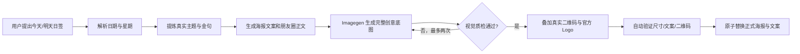

<p align="center">
  
</p>

# GULIAI 日签海报 Skill

<p align="center">从真实理念出发，生成可直接发布的个人品牌日签海报与朋友圈文案。</p>

<p align="center">
  
  
  
</p>

> [!IMPORTANT]
> 这是一个面向 Codex 的个性化品牌生产 Skill：它负责“选题—文案—生图—质检—真实资产合成—安全发布”的完整流程，但不内置真人肖像、微信二维码、聊天原文或任何本机路径。

> **定位**：把真实观点转成构图可变化、真实资产可复用的个人品牌日签。<br>
> **不做什么**：不重绘真实二维码或 Logo，不把私人素材和聊天内容打包进公开仓库，也不把固定版式误当成品牌一致性。

## 为什么需要它

日签不只是每天换一句话。真正稳定的个人品牌内容，需要同时守住三件事：观点来自本人、视觉保持一致、二维码能够真实使用。

本 Skill 将这些要求固化为可重复执行的流程：

- 从当前对话、获授权的历史对话或私有理念库中提炼真实观点；
- 生成 2:3 品牌日签底图，保持人物身份与 GULIAI 视觉气质；
- 将真实二维码和官方 Logo 在生图完成后确定性叠加，避免模型重绘失真；
- 同步生成只含正文、可一键全选复制的 `朋友圈文案.md`；
- 发布前检查尺寸、文案结构和二维码像素一致性，失败时保留上一组正式文件。

## 工作流程



## 核心能力

| 能力 | 结果 |
|---|---|
| 理念选题 | 优先使用用户真实表达，并对近 30 天主题去重 |
| 日签文案 | 主标题、正文、英文点缀、星期标签形成单一清晰观点 |
| 视觉生成 | 1024×1536、动态构图路线、人物约占画面 1/3；支持人物单侧、结构叙事、分栏杂志与水彩转场 |
| 品牌资产保护 | 二维码和 Logo 不交给模型重绘，最后再精确合成 |
| 底部安全带 | 二维码与 Logo 的覆盖范围保持连续自然背景；无人物遮挡、无色块占位框 |
| 朋友圈文案 | 80–130 个可见字符，2–5 个自然段，只保留可发布正文 |
| 安全发布 | 校验通过后成对替换文件；中途失败自动恢复旧版本 |

## 海报示例

<table>
  <tr>
    <td align="center"></td>
    <td align="center"></td>
    <td align="center"></td>
  </tr>
  <tr>
    <td align="center">让积累重新发光</td>
    <td align="center">把经验重新组合</td>
    <td align="center">先让行动给出答案</td>
  </tr>
</table>

> 公开示例已将真实微信二维码替换为不可扫描的示意区域。实际运行时，Skill 会在最终步骤叠加用户本机配置的真实二维码。

## 适用场景

- 生成今天、明天、昨天或指定日期的个人品牌日签；
- 将真实理念、复盘和业务判断转成公开安全的金句；
- 连续生产风格稳定、构图有变化的一周日签；
- 为海报同步生成可直接复制的朋友圈正文；
- 需要确保二维码可扫、Logo 不被生成模型改写的品牌内容。

## 安装

### 方式一：克隆到 Codex Skills 目录

```bash
git clone https://github.com/OWENWANG-GULIAI/guliai-daily-signature.git
mkdir -p "${CODEX_HOME:-$HOME/.codex}/skills"
cp -R guliai-daily-signature "${CODEX_HOME:-$HOME/.codex}/skills/"
```

重启 Codex 或重新载入 Skills 后即可使用。

### 方式二：仅用于开发

直接克隆仓库，在仓库根目录运行测试；需要实际生成海报时，再把目录安装到 Codex Skills 目录。

## 首次配置

准备你有权使用的三项素材：

1. 本人透明底或干净背景肖像；
2. 官方横向 Logo；
3. 可正常扫码的真实二维码。

然后在 Skill 目录运行：

```bash
python3 scripts/daily_signature_ops.py configure \
  --portrait "/absolute/path/to/portrait.png" \
  --logo "/absolute/path/to/logo.png" \
  --qr "/absolute/path/to/contact-qr.jpg" \
  --output-dir "/absolute/path/to/output"
```

配置会写入本机 `state/local-config.json`。`state/` 已被忽略，不应提交到公开仓库。

## 使用方法

在 Codex 中自然表达即可：

```text
使用 $guliai-daily-signature 生成今天的日签海报。
```

也可以指定日期或主题：

```text
使用 $guliai-daily-signature 生成明天的日签，主题围绕“经验不是包袱，而是新局的起点”。
```

## 输入与输出

最小输入是日期意图，例如“今天”或“明天”。用户也可以补充主题、原句和当天希望表达的重点；没有指定主题时，Skill 会按授权范围从真实对话与私有理念库中提炼。

默认输出：

- `今日日签海报.png`：1024×1536 PNG；
- `朋友圈文案.md`：只含可直接发布的朋友圈正文。

## 运行依赖

- 支持 Skills 与 `imagegen` 的 Codex 环境；
- Python 3.9 或更高版本；
- `ffmpeg` 与 `ffprobe`；
- 用户自行提供并有权使用的肖像、Logo 与二维码素材。

## 质量与测试

```bash
python3 -m unittest discover -s tests -v
python3 scripts/daily_signature_ops.py resolve-date --when tomorrow --today 2026-09-15
```

测试覆盖日期解析、朋友圈文案合同、坐标缩放、Logo 默认坐标不越界、二维码像素保真、发布失败回滚、底部安全区合同和公开包边界。

## 隐私与安全

- 真人肖像、真实二维码、本机配置、聊天原文和使用日志只保存在本机；
- 公开仓库只包含工作流、确定性工具、文档和已经脱敏的示例图；
- 历史对话仅在用户已授权且当前环境可访问时读取；
- 日志只保存公开安全的来源摘要，不复制敏感聊天内容；
- 公开示例中的二维码已替换，不可用于联系本人。

## 当前边界

- 不会凭空捏造用户经历、成绩、收入或客户结果；
- 不会在没有授权时读取或发布私人对话；
- 不会把生图模型生成的二维码当作可用二维码；
- 不会自动发布到朋友圈，也不替代素材版权与隐私授权判断；
- 缺少真实二维码时只可生成预览，不会覆盖正式交付文件。

## 目录结构

```text
guliai-daily-signature/
├── SKILL.md
├── agents/openai.yaml
├── assets/
├── examples/
├── references/
├── scripts/daily_signature_ops.py
├── tests/
├── ASSET_LICENSE.md
├── LICENSE
└── VERSION
```

## 品牌与许可

代码与文档以 [MIT License](LICENSE) 开源。GULIAI 名称、Logo 与相关品牌识别不在 MIT 授权范围内，详见 [ASSET_LICENSE.md](ASSET_LICENSE.md)。仓库中的 Logo 仅用于识别本项目与展示官方品牌来源，不授予商标、转售、再分发或暗示合作关系的权利。

维护者：王跃平 OWENWANG

## 参与贡献

欢迎通过 Issue 报告可复现的问题，或提交聚焦且带测试的 Pull Request。涉及真人肖像、二维码、客户数据或品牌素材时，请只使用虚构或已脱敏样例；不要把本机 `state/` 目录提交到仓库。
