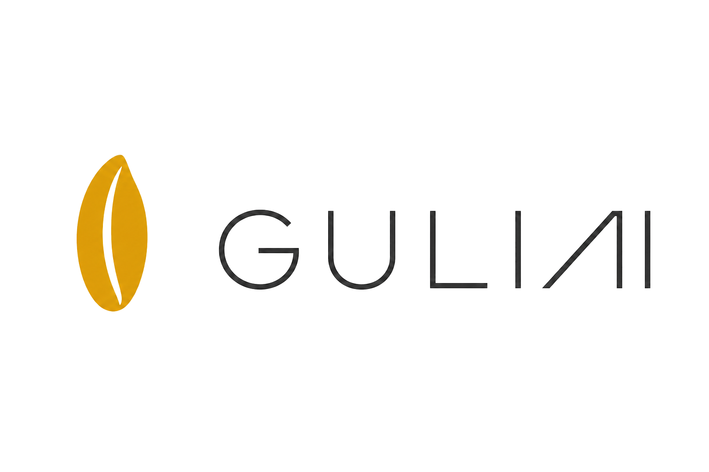
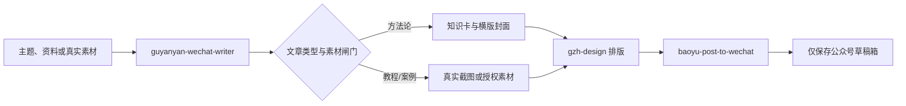

<div align="center">

<p></p>

# GULIAI 公众号自动化 Skill 套件

**把可信写作、信息型配图、公众号排版与草稿箱保存串成一条可复用工作流。**


</div>

> **定位**：面向有自己写作资料、品牌规范和已开通公众号 API 的创作者，提供从文章成稿到公众号草稿箱的 Skills 协作流程。<br>
> **不做什么**：不内置真实客户、学员、私人写作库、真人肖像、公众号凭据，也不会自动群发或公开发布文章。

## 导航

- [为什么需要它](#为什么需要它)
- [快速开始](#快速开始)
- [工作原理](#工作原理)
- [能力与适用场景](#能力与适用场景)
- [隐私与边界](#隐私与边界)

## 为什么需要它

一篇可发的公众号文章，不是只把文字写完。它还要区分文章类型、让图片承担理解任务、适配公众号阅读排版、使用正确封面，并在发布前检查真实素材与事实边界。

这套 Skills 把这些判断拆为可维护的环节：写作不把 AI 图当装饰；教程和案例不伪造截图；方法论文章的知识卡负责解释观点；最后只保存到草稿箱，保留人工审核与群发决定权。

## 快速开始

### 1. 安装本套自定义 Skills

```bash
git clone https://github.com/OWENWANG-GULIAI/guyanyan-wechat-automation.git
mkdir -p "${CODEX_HOME:-$HOME/.codex}/skills"
cp -R guyanyan-wechat-automation/skills/* "${CODEX_HOME:-$HOME/.codex}/skills/"
```

### 2. 安装两个外部依赖

本仓库不复制第三方源码。请分别按其原仓库的许可和安装说明安装：

```bash
npx skills add https://github.com/isjiamu/gzh-design-skill
# 再安装 baoyu-post-to-wechat：
# https://github.com/JimLiu/baoyu-skills
```

### 3. 添加你的私有配置

按 [私有配置说明](docs/private-configuration.md) 在本机指定写作资料库、固定尾图（可选）、人物参考图（可选）和公众号 API 凭据。它们都不应提交到本仓库。

### 调用示例

```text
使用 $guyanyan-wechat-pipeline，把这份课程整理整理成一篇公众号文章，并保存到草稿箱。
```

预期输出：文章 Markdown、必要的知识卡或真实截图清单、公众号适配 HTML 与预览；通过素材闸门后，保存一份公众号草稿。

## 工作原理



## 核心能力

- 观点 / 方法论文章：生成一张 2.35:1 横版封面和 3–5 张解释核心关系的知识卡，而不是氛围填充图。
- AI 教程：用清晰编号步骤和精确截图说明组织内容；没有真实截图时不创建草稿。
- 学员案例：只编排已授权的真实素材，不生成伪造的“案例现场图”。
- 公众号排版：交给外部 `gzh-design` 生成内联样式 HTML，并进行发布前校验。
- 草稿幂等：对最终 HTML 和图片取指纹，避免相同成品重复创建草稿。

## 适用场景

- 把课程、讲义、文档或访谈整理成公众号文章；
- 用个人品牌的真实判断持续输出方法论内容；
- 已配置公众号 API，且希望把审核后的成品保存至草稿箱。

## 示例

> 本例为匿名化示例，不包含真实个人、客户、学员或私聊信息。

输入：“把一份关于经验产品化的课堂要点整理成公众号文章。”

输出路径：先判为方法论文章，提炼一个主命题；设计“内容不等于产品”的对照卡、“用户—任务—判断—交付”的结构卡和行动清单卡；生成横版封面，排版为 HTML，并在图片和 HTML 全部通过检查后保存到草稿箱。

## 输入与输出

| 类型 | 内容 |
|---|---|
| 输入 | 主题、文档、课堂材料、初稿，或已获授权的案例/截图素材 |
| 输出 | Markdown、图片计划或真实截图提示、PNG 知识卡、2.35:1 封面、HTML、预览和草稿 `media_id` |

## 仓库结构

- [`skills/guyanyan-wechat-pipeline`](skills/guyanyan-wechat-pipeline)：总控、素材闸门与草稿幂等脚本。
- [`skills/guyanyan-wechat-writer`](skills/guyanyan-wechat-writer)：三类文章的写作与图文路由规则。
- [`skills/guliai-visual-design`](skills/guliai-visual-design)：用于方法论知识卡和横版封面的品牌视觉规则。
- [`docs/private-configuration.md`](docs/private-configuration.md)：本机私有资产与公众号 API 配置要求。
- [`NOTICE.md`](NOTICE.md)：外部依赖与许可证说明。

## 质量保证

发布前应至少完成：

```bash
python3 skills/guyanyan-wechat-pipeline/scripts/draft_state.py --help
python3 -m compileall -q skills/guyanyan-wechat-pipeline/scripts
```

实际运行时，还应执行 `gzh-design` 提供的 HTML 校验器，并逐张检查中文文字、信息关系、人物姿态、裁切与图片顺序。任何素材、封面或事实边界不满足条件时，工作流停在草稿创建之前。

## 隐私与边界

- 公众号 `AppID`、`AppSecret`、访问令牌和白名单配置只保存在本机；
- 私人写作基因库、客户/学员资料、真实聊天、头像和固定个人介绍尾图不包含在本仓库；
- GULIAI 名称与 Logo 仅用于识别本项目，不授予商标、背书或商业合作权利，详见 [ASSET_LICENSE.md](ASSET_LICENSE.md)；
- 对公众号的唯一外部写入是创建草稿；不会自动群发、定时发送、删除或修改既有草稿。

## 当前版本边界

- 这不是一个不需要配置即可发布的 SaaS：使用者需自行安装外部依赖、提供真实素材并配置自己的公众号 API；
- 文章事实、案例授权与图片版权仍由使用者确认；
- 图像模型可能产生错字或不合理肢体，知识卡必须通过人工视觉检查后才能进入草稿。

## 参与贡献

欢迎提交聚焦的 Issue 或 Pull Request。请用虚构或充分匿名化的资料复现问题；不得提交公众号凭据、真人肖像、二维码、客户/学员信息、本机绝对路径或草稿状态文件。

## 许可证

代码与文档按 [MIT License](LICENSE) 发布。品牌名称和 Logo 适用单独的 [品牌资产使用说明](ASSET_LICENSE.md)。外部依赖不被复制进本仓库，仍各自适用原有许可证。

---

让内容有判断，让配图帮助理解，让发布保留最后的人类审核。
