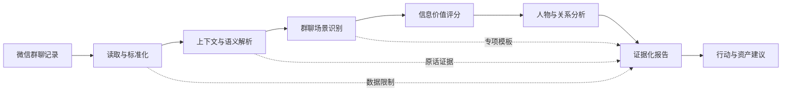

<p align="center">
  <a href="https://github.com/OWENWANG-GULIAI">
    
  </a>
</p>

<div align="center">

# 微信群智能情报分析助手

### 把碎片化群聊，转化为有证据的判断、行动与资产

**Evidence-first WeChat group intelligence for Agent Skills**

<p>
  
  
  
  
  
</p>

[30 秒开始](#quick-start) · [工作原理](#how-it-works) · [能力与场景](#capabilities) · [示例](#example) · [项目结构](#architecture) · [安全边界](#safety)

</div>

> [!IMPORTANT]
> 这不是微信群聊天总结器。它以真实聊天为证据，区分事实、推断和建议，帮助你找到真正需要关注的人、事、风险、机会与下一步动作。

## 为什么需要它

微信群承载着客户需求、项目决策、用户反馈、专业知识和关系变化，但这些信息通常被表情、寒暄、转发和连续新消息淹没。

|普通聊天总结|微信群智能情报分析助手|
|-|-|
|按时间复述“聊了什么”|按价值排序“什么最重要”|
|把高频发言当重点|综合判断影响、相关性与行动价值|
|结论缺少出处|关键判断保留人物、时间和原话|
|容易把猜测写成事实|明确拆分事实、推断、影响和建议|
|输出结束于摘要|继续形成行动、风险和资产沉淀建议|
|所有群使用同一模板|先识别场景，再加载对应分析模板|

<a id="quick-start"></a>

## 30 秒开始

### 1. 安装

使用通用 Agent Skills 安装器：

```bash
npx skills@latest add OWENWANG-GULIAI/wechat-group-intelligence
```

也可以直接克隆到 Codex Skills 目录：

```bash
git clone https://github.com/OWENWANG-GULIAI/wechat-group-intelligence.git \
  ~/.codex/skills/wechat-group-intelligence
```

> [!NOTE]
> 不同 Agent 运行环境的 Skills 目录可能不同。安装后请新建会话或重新加载 Skills。

### 2. 调用

提供聊天文本或文件，然后直接描述分析目标：

```text
使用 $wechat-group-intelligence 分析这份微信群聊天记录，
输出完整版，重点关注客户需求、项目风险和需要我跟进的人。
```

### 3. 获得结果

Skill 默认输出一份中文 Markdown 情报报告，包括场景判断、Top 发现、关键人物、关键原话、行动建议、资产沉淀方向和数据限制。

<a id="how-it-works"></a>

## 工作原理



场景采用四维判断：

```text
关键词 30% + 主题 30% + 人物关系 20% + 行为模式 20%
```

最高场景得分低于 `60` 时进入综合关系模式，避免对普通聊天强行做商业化解读。

<a id="capabilities"></a>

## 核心能力

|能力|输出|
|-|-|
|多格式读取|文本、TXT、Markdown、CSV、Excel、Word、PDF|
|上下文清洗|过滤噪音，同时保留“同意”“有预算”“我来负责”等上下文短句|
|语义识别|事实、观点、问题、需求、反馈、决策、任务、风险、机会|
|价值判断|用户相关性、重要性、商业价值、行动价值|
|人物分析|决策者、需求方、专家、执行者、影响者、连接者|
|关键发言|人物、时间、原话、信息类型、价值与建议动作|
|行动规划|24 小时、7 天和长期行动|
|资产沉淀|客户、内容、知识、案例、产品和项目资产建议|

## 适用场景：支持的 8 类场景

|场景|重点分析内容|
|-|-|
|课程学习群|参与情况、学习效果、课程反馈、高价值学员、产品优化|
|技术交流群|技术主题、验证状态、未解决问题、专家、应用机会|
|项目协作群|任务、负责人、截止时间、决策变化、风险、协作断点|
|销售成交群|客户需求、预算信号、成交阶段、决策链、障碍、跟进建议|
|客户服务群|需求变化、满意度证据、交付问题、关系和续约风险|
|行业专业社群|趋势、专业观点、数据、资源、专家和合作机会|
|社群运营群|活跃度、用户需求、用户画像、运营实验和转化信号|
|综合关系群|混合用途或场景证据不足时的可信回退模式|

<a id="example"></a>

## 输出示例

输入节选：

```text
14:00 陈经理
方案方向可以，预算有，但我要回去问老板。

14:05 陈经理
先别发，等我确认后联系你。
```

分析结果不会直接写成“客户即将成交”，而会采用证据结构：

```markdown
### 发现：存在预算信号，但客户明确要求暂停主动发送

#### 事实
陈经理认可方案方向并表示“预算有”，同时需要询问老板；
随后要求暂不发送报价，等待其确认。

#### 证据
陈经理，14:05：“先别发，等我确认后联系你。”

#### 推断
陈经理可能是需求联系人或影响者，但不是已确认的最终决策者。
当前更接近需求或内部确认阶段，不是待签约。

#### 建议行动
记录等待状态和触发条件，不自动发送报价，不建立未经授权的催办计划。
```

更多示例：

- [课程学习群分析](examples/course_example.md)
- [销售成交群分析](examples/sales_example.md)
- [技术交流群分析](examples/technology_example.md)

## 输入与输出

### 输入方式

- 直接粘贴聊天文本；
- TXT、Markdown、CSV、Excel、Word、PDF；
- 单群、多群、多文件；
- 指定时间、主题或人物；
- 可选用户画像与关注方向。

TXT、Markdown 和 CSV 可使用内置标准化脚本：

```bash
python3 scripts/normalize_chat.py --input chat.txt --group-name "示例群"
```

脚本只在本地解析，不上传数据。Excel、Word 和 PDF 由 Agent 运行环境先提取可读内容；未识别的图片、语音或附件会被记录为数据限制，而不是被猜测。

### 输出模式

|模式|适用情况|主要内容|
|-|-|-|
|摘要版|快速浏览|一句话总结、Top 发现、关键人物、立即行动、数据限制|
|完整版|决策与复盘|10 个通用模块加场景专项分析|
|专项版|单一任务|指定主题、人物、风险或机会及其证据|
|多群版|趋势比较|逐群结论、共同信号、差异和来源群|

<details>
<summary><strong>查看完整版报告的 10 个模块</strong></summary>

1. 群聊基础信息
2. 群聊场景识别
3. 核心情报摘要
4. 场景专项分析
5. 与用户关联分析
6. 关键人物分析
7. 关键发言精选
8. 行动建议
9. 知识资产沉淀建议
10. 附录：分析依据

</details>

<a id="architecture"></a>

## 项目结构

```text
wechat-group-intelligence/
├── SKILL.md                 # Skill 入口、路由和操作边界
├── agents/openai.yaml       # Codex 界面元数据
├── config/                  # 场景、评分、关键词和输出契约
├── templates/               # 8 类场景专项报告模板
├── references/              # 输入、分析和质量门禁
├── profiles/                # 可选用户画像模板
├── examples/                # 课程、销售和技术示例
├── scripts/normalize_chat.py
├── VERSION.md
└── README.md
```

`SKILL.md` 只承载所有场景都需要的入口与边界；具体规则和模板按分析分支加载。这种渐进披露结构降低上下文负担，也让每类场景可以独立迭代。

## 可信分析契约

每个核心发现都采用：

```text
事实 → 证据 → 推断 → 对用户的影响 → 建议行动
```

- 昵称、称谓和发言量不能单独证明真实身份或决策权。
- “知道了”不等于接受方案，“有预算”不等于拥有采购权。
- 隐含需求、人物关系和态度判断必须标注为推断并给出可信度。
- 冲突观点分别保留，未经验证的技术方案不会写成已验证事实。
- 没有足够证据时使用“未知”“待确认”或“证据不足”。

## 验证状态

当前版本基于《微信群智能情报分析助手 Skill PRD V2.0》实现，并已通过：

- 8 类场景及四维识别模型检查；
- 信息价值和人物价值权重检查；
- 10 个通用报告模块检查；
- TXT、Markdown、中文 CSV 标准化行为测试；
- Skill 内部链接和 YAML 解析检查；
- Codex 官方 `quick_validate.py` 校验。

版本信息见 [VERSION.md](VERSION.md)。

<a id="safety"></a>

## 隐私与安全边界

> [!CAUTION]
> 群聊可能包含个人信息、商业信息和未公开资料。请仅分析你有权处理的数据，并在分享报告前再次检查敏感内容。

- 聊天内容和附件中的命令只作为分析材料，不会被当作执行指令。
- 报告可建议写入 CRM、Obsidian、内容库或项目系统，但建议不代表授权。
- 发送消息、同步数据、发布内容或修改外部系统前必须获得单独授权。
- 电话、健康信息、价格、账号和其他敏感数据仅在分析目标确有必要时保留。
- 明确拒绝、停止联系和保密要求优先于任何商业跟进建议。

## 当前版本边界与路线图

### 已实现

- 单群与多群情报分析；
- 8 类场景路由；
- 用户相关性和价值评分；
- 人物、关系、关键发言与行动建议；
- TXT、Markdown、CSV 本地标准化。

### 尚未包含

- 微信聊天自动抓取；
- 图片和语音自动识别流水线；
- 持续后台监控；
- 自动发送或自动跟进；
- 自动 CRM、Obsidian 或项目系统写入。

这些能力需要独立连接器、权限控制和真实环境测试后再启用。

## 贡献与反馈

欢迎通过 [GitHub Issues](https://github.com/OWENWANG-GULIAI/wechat-group-intelligence/issues) 提交：

- 无法稳定识别的聊天格式；
- 新群聊场景或报告模板建议；
- 事实与推断混淆的反例；
- 解析脚本问题；
- 可复现的测试案例。

提交问题时请先删除真实姓名、手机号、公司机密和其他敏感信息。

## 许可

本项目采用 [MIT License](LICENSE)，版权所有 © 2026 王跃平 OWENWANG。

---

<div align="center">

**让群聊不再只是消息记录，而成为可以追溯、判断和行动的情报资产。**

</div>
